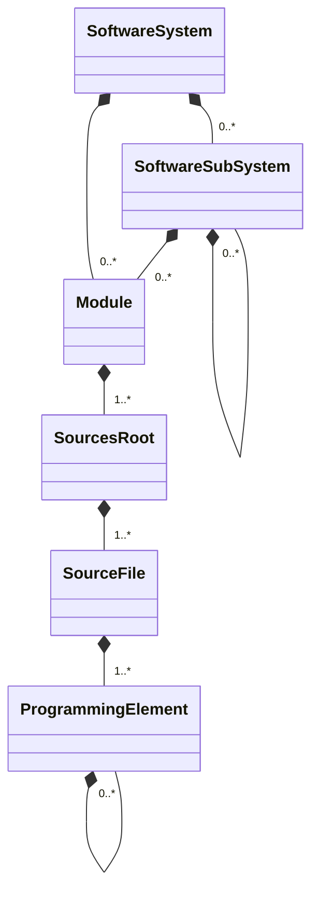

# Core Component Model

```mermaid
classDiagram
    SoftwareSystem *-- "0..*" Module
    SoftwareSystem *-- "0..*" SoftwareSubSystem
    SoftwareSubSystem *-- "0..*" SoftwareSubSystem
    SoftwareSubSystem *-- "0..*" Module
    Module *-- "1..*" SourcesRoot
    SourcesRoot *-- "1..*" SourceFile
    SourceFile *-- "1..*" ProgrammingElement
    ProgrammingElement *-- "0..*" ProgrammingElement
    
    class SoftwareSubSystem
    class Module
    class SourcesRoot
    class SourceFile
    class ProgrammingElement
```